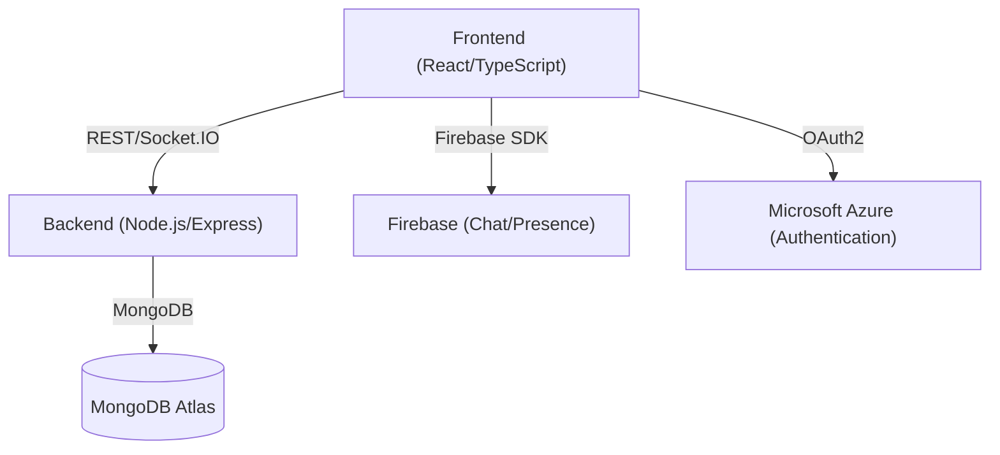

# Cheems

Cheems is a web-based communication platform inspired by Microsoft Teams, enabling users to connect via video conferencing and real-time text messaging. Built for the [Microsoft Engage 2021](https://microsoft.acehacker.com/engage2021/) challenge, Cheems demonstrates a full-stack approach to modern, scalable, and interactive communication apps.

---

## Table of Contents

- [Features](#features)
- [Architecture Overview](#architecture-overview)
- [Tech Stack](#tech-stack)
- [Installation & Setup](#installation--setup)
- [Third-Party Tools & Services](#third-party-tools--services)
- [Usage](#usage)
- [Folder Structure](#folder-structure)
- [Contributing](#contributing)
- [License](#license)
- [Contact](#contact)

---

## Features

- **Microsoft Account Authentication** (via Azure)
- **Video Conferencing** (1:1 and group calls)
- **Real-time Chat** (with persistent history)
- **Invite Links** for meetings and chats
- **Responsive UI** (desktop & mobile)
- **User Presence & Status**
- **Modern UI/UX** (Chakra UI, Framer Motion)
- **Secure JWT-based Backend**
- **Cloud Database** (MongoDB Atlas)
- **Firebase Integration** (for chat and presence)
- **Scalable WebSocket Communication** (Socket.IO)

---

## Architecture Overview



- **Frontend**: React app (TypeScript), handles UI, authentication, and real-time features.
- **Backend**: Node.js/Express, manages authentication, user data, and signaling for calls.
- **Database**: MongoDB Atlas for persistent user and room data.
- **Real-time**: Socket.IO for signaling and call setup.
- **Chat/Presence**: Firebase Firestore for chat messages and user presence.
- **Authentication**: Microsoft Azure AD (OAuth2) for secure login.

---

## Tech Stack

### Frontend

- **React.js** (TypeScript)
- **Chakra UI** (component library)
- **Framer Motion** (animations)
- **React Router** (routing)
- **Socket.IO Client** (real-time communication)
- **Firebase JS SDK** (Firestore for chat, presence)
- **MSAL (Microsoft Authentication Library)** (Microsoft OAuth)
- **Axios** (HTTP requests)
- **Simple-Peer** (WebRTC abstraction for peer-to-peer video/audio)
- **WebRTC APIs** (mediaDevices, getUserMedia)
- **uuid** (unique IDs)
- **React Firebase Hooks** (Firebase integration)
- **Jest** & **React Testing Library** (testing)
- **TypeScript** (static typing)

### Backend

- **Node.js** (Express)
- **Socket.IO** (real-time signaling)
- **MongoDB** (Mongoose, MongoDB client)
- **JWT** (jsonwebtoken, authentication)
- **dotenv** (environment variables)
- **body-parser** (request parsing)
- **uuid** (unique IDs)
- **Nodemon** (development server)
- **ESLint** & **Prettier** (linting/formatting)

### Real-Time & Peer-to-Peer

- **WebRTC** (via Simple-Peer and direct use of mediaDevices/getUserMedia)
- **Socket.IO** (signaling for WebRTC, chat, and presence)

### Third-Party Services

- **MongoDB Atlas** (cloud database)
- **Firebase** (Firestore for chat, presence)
- **Microsoft Azure** (OAuth authentication)

---

## Installation & Setup

### Prerequisites

- **Node.js** (v12+)
- **npm** or **yarn**
- **MongoDB Atlas** account
- **Firebase** project
- **Microsoft Azure** account (for OAuth)

### 1. Clone the Repository

```bash
git clone https://github.com/dmahajan980/ms-engage-2021.git
cd ms-engage-2021
```

### 2. Backend Setup

```bash
cd backend
npm install
cp .env.template .env
# Edit .env with your MongoDB URI, JWT secret, and desired PORT
```

- **MONGODB_URI**: Your MongoDB Atlas connection string
- **JWT_SECRET**: Any random string (keep it secret)
- **PORT**: Backend port (default: 9000)

### 3. Firebase Setup

- Create a Firebase project: [Firebase Console](https://console.firebase.google.com/)
- Get your web app credentials (API key, project ID, etc.)
- Add these to your frontend environment variables (see below).

### 4. Microsoft Azure Setup

- Register your app at [Azure Portal](https://portal.azure.com/)
- Get your client ID, tenant ID, and other credentials.
- Add these to your frontend environment variables.

### 5. Frontend Setup

```bash
cd ../frontend
npm install
# or
yarn install
cp .env.template .env
```

- Add your Firebase and Azure credentials in the **.env** file.

### 6. Run the App

- **Backend**:  
  ```bash
  cd backend
  npm start
  ```
- **Frontend**:  
  ```bash
  cd frontend
  npm start
  # or
  yarn start
  ```

- Visit [http://localhost:3000](http://localhost:3000)

---

## Third-Party Tools & Services

- **MongoDB Atlas**: Cloud database
- **Firebase**: Real-time chat and presence
- **Microsoft Azure**: Authentication (OAuth2)
- **Socket.IO**: Real-time signaling
- **Chakra UI**: UI components
- **Framer Motion**: Animations

---

## Usage

- **Sign in** with your Microsoft account.
- **Start a new meeting** or **join** with an invite link.
- **Chat** with other users in real time.
- **Invite** users to calls directly from chat.

---

## Folder Structure

```
ms-engage-2021-main/
  backend/         # Node.js backend (Express, MongoDB, Socket.IO)
    src/
      routes/      # API routes (auth, users, home)
      db/          # Database models and schema
      socket/      # Socket.IO logic
  frontend/        # React frontend (TypeScript, Chakra UI)
    src/
      components/  # React components (Chat, Call, UI)
      config/      # Firebase, Azure, theme configs
      context/     # React context providers
      hooks/       # Custom React hooks
      utils/       # Utility functions
```

---

## Contributing

Contributions are welcome! Please open issues or pull requests for improvements, bug fixes, or new features.

---

## License

[MIT](LICENSE)

---

## Contact

- **Author**: Divyanshu Mahajan
- **Challenge**: Microsoft Engage 2021
- **Email**: [divyanshumahajan98@gmail.com]

---

**Note:**  
- For production deployment, configure environment variables securely and use HTTPS.
- For more details, see the code comments and configuration files.
